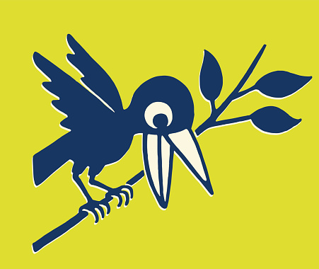

<h1 align="center">

 
Traveller Crow</h1>

Web app which suggests good restaurants, hotels, and tourist attractions around any location.

Tech Stack:
- React Js
- Rapid API
- Google Maps API 
- Material UI

## About

- This app display the list of hotels, restaurants and tourist attractions and also pin points it on the map.
- You can select between hotels, restaurants and tourist attractions whichever you want to see.
- You can filter them out on the basis of their ratings.
- Also shows weather details of that location on the map
- Can get your location automatically, or you can change to any other location using the search bar provided.

Live @ [Traveller Crow](https://traveller-crow.netlify.app//)

## Requirements

1. **Node**

    -   after installing node to your system, the further requirements are in `package.json` file
    -   To install, run"
                
            npm install    

    ### How to run :

    After installing the mentioned dependencies, open your terminal in the root directory and then run the following commands :

        npm run start

## Developer:

#### _Yash Joglekar_

My GitHub - [YASHBRO](https://github.com/YASHBRO/ "Contact me here")

_For suggestions or bug/error report:_

-   Raise an issue, I'll surely look into it as soon as possible
-   Or mail me @ :- [yashjoglekar2012@gmail.com](https://mail.google.com/mail/u/0/?fs=1&to=yashjoglekar1220@gmail.com&su=Issue+with+Traveller+Crow+repository&body=Write+your+issues+here:%0A "Click to send an email")
